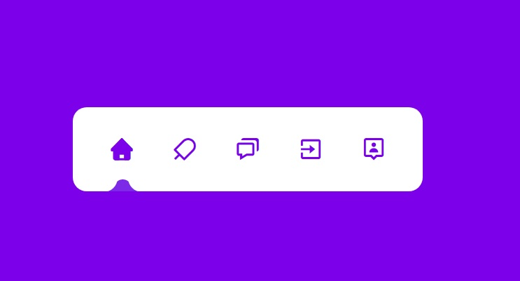

# interactive-menu

> Menu com ícones interativos que quando são acionados com um clicke fazem o indicador abaixo mudar de posição ao mesmo tempo que o ícone muda de cor. Essa transição acontece de forma suave.

## 🤝 Colaboradores

<table>
  <tr>
    <td align="center">
      <a href="https://www.linkedin.com/in/anderson-oliva/">
         
        
          <b>Anderson Oliva</b>
        
      </a>
    </td>
    <td align="center">
      <a href="https://www.linkedin.com/in/rodolfomori/">
         
        
          <b>Rodolfo Mori</b>
        
      </a>
    </td>
    
  </tr>
</table>

